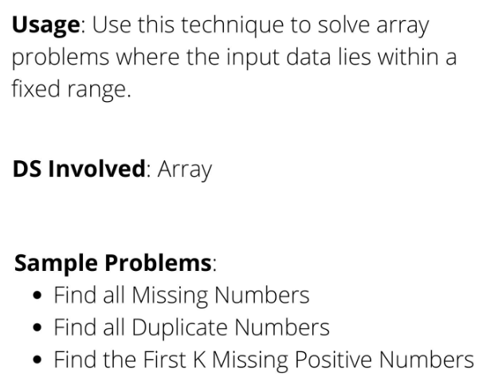
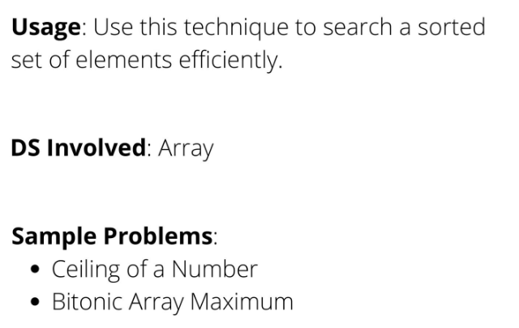

# NEET-CODE-150... But let's even try NeetCode All, and CodeForces
https://neetcode.io/practice  
https://codeforces.com

# 20 Coding pattern src = DesignGurus
<ol>
  <li>Sliding Window
     
    
  </li>
  <li>Islands (Matrix Traversal)
     
    
  </li>
  <li>Two Pointers
     
    
  </li>
  <li>Fast & Slow Pointers
   
    
  </li>
  <li>Merge Intervals
   
    
  </li>
  <li>Cyclic Sort
     
    
  </li>
  <li>In-place Reversal of a LinkedList
     
    
  </li>
  <li>Tree Breadth-First Search
     
    
  </li>
  <li>Tree Depth-First Search
     
    
  </li>
  <li>Two Heaps
     
    
  </li>
  <li>Subset
     
    
  </li>
  <li>Modified Binary Search
     
    
  </li>
  <li>Bitwise XOR
     
    
  </li>
  <li>Top ‘K’ Elements
     
    
  </li>
  <li>K-way Merge
     
    
  </li>
  <li>Topological Sort
     
    
  </li>
  <li>Unbounded Knapsack
     
    
  </li>
  <li>Fibonacci Numbers
     
    
  </li>
  <li>Palindromic Subsequence
     
    
  </li>
  <li>Longest Common Substring
     
    
  </li>
</ol>
